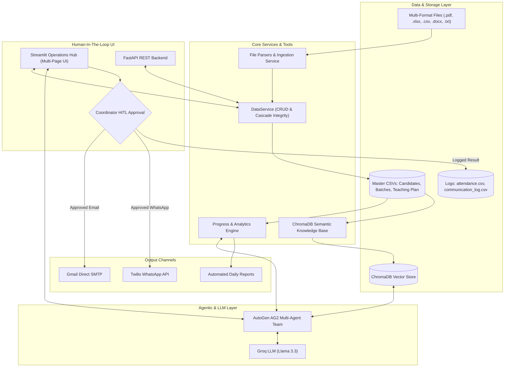

# ⚡ Admin Automation Agent

> **An Agentic AI Coordinator Platform that eliminates administrative toil by auto-generating daily session reports, drafting targeted absentee communications, tracking curriculum progress, managing candidate rosters, and answering natural-language queries via ChromaDB RAG & AutoGen AG2.**

---

[](https://www.python.org/)
[](https://streamlit.io/)
[](https://fastapi.tiangolo.com/)
[](https://ag2.ai/)
[](https://www.trychroma.com/)
[](https://groq.com/)
[](https://www.twilio.com/)
[](LICENSE)

---

## 🎯 Problem Statement & Impact

Training program coordinators face overwhelming administrative toil: manually logging attendance, finding absent candidates, drafting individualized outreach emails and WhatsApp messages, keeping curriculum progress up-to-date, and answering recurring coordinator/HR queries.

Because many program coordinators are **Persons with Disabilities (PWDs)**, automating repetitive manual operations delivers **direct accessibility and social impact**—eliminating hours of tedious workload every week and empowering coordinators to focus on high-touch candidate guidance.

---

## 🚀 Key Features & Capabilities

### 1. 📋 Multi-Format File Upload & Ingestion
Upload files in any standard format (`.csv`, `.xlsx`, `.pdf`, `.docx`, `.txt`):
* **Teaching Plan / Syllabus**: Intelligent layout parser extracts modules, session numbers, topics, and subtopics directly from PDF tables or documents, automatically indexing them into ChromaDB for semantic RAG retrieval.
* **Candidates Roster**: Bulk import or append candidate records with automatic schema normalization.
* **Batches Schedule**: Bulk import batch programs, date ranges, and coordinator allocations.

### 2. ✏️ Interactive CRUD & Cascading Data Management
* **Inline Data Editor**: Double-click cells to edit records in real-time.
* **Bulk Deletion with "Select All"**: One-click select-all checkbox for rapid batch-clearing.
* **Cascading Data Integrity**: Deleting a batch automatically cascades to wipe all enrolled candidates, their attendance history, and their session/communication logs.
* **Manual Record Entry**: Expanding quick-entry forms with dynamic dropdowns.

### 3. ✍️ Daily Attendance & Automated Absentee Processing
* Human-in-the-loop attendance tracking: check off absent candidates for any session.
* Auto-calculates present/absent counts and attendance percentages.
* Automatically drafts customized outreach notifications.

### 4. 💬 Human-In-The-Loop Communication Center
* **Separation of Concerns**: AI drafts absentee notices, but dispatches occur **only** after explicit coordinator review and approval.
* **Multi-Channel Dispatch**: 
  - **Email**: Secure direct SMTP via Gmail App Passwords.
  - **WhatsApp**: Direct automated messaging via Twilio REST API.
* **Audit Trail**: Every draft, approval timestamp, and API response is logged in `communication_log.csv`.

### 5. 🤖 Natural Language AI Assistant (AutoGen AG2 + ChromaDB RAG)
Ask complex questions in plain English:
* *"Who was absent in session 67?"*
* *"What is today's topic and key concepts?"*
* *"Which candidates have attendance below 75%?"*
* Powered by **Groq Llama 3.3**, **AutoGen AG2**, and **ChromaDB Vector Store**.

### 6. 📊 Real-Time Operations Dashboard & Analytics
* Curriculum velocity and calendar-based progress tracking.
* Dynamic donut and bar chart visualizations with Plotly.
* Automatic detection of repeat absentees (2+ missed sessions) and low-attendance warnings (<75%).
* Coordinator scheduling conflict detection across concurrent batches.

---

## 🏗️ System Architecture



---

## 📁 Repository Structure

```
Admin Automation Agent/
├── .env.example                  # Template for required environment variables
├── .gitignore                    # Git ignore definitions for secrets, venv, and caches
├── requirements.txt              # Complete Python dependencies
├── streamlit_app.py              # Main Streamlit entrance & operations dashboard
├── Session_wise_Teaching_Plan.pdf# Sample curriculum document
│
├── pages/                        # Streamlit Multi-Page Interface
│   ├── 1_📊_Dashboard.py         # Real-time metrics, analytics & alerts
│   ├── 2_✍️_Mark_Attendance.py   # Daily attendance submission & report generator
│   ├── 3_🕒_Attendance_History.py # Past session logs & drilldown inspection
│   ├── 4_📋_Candidates.py        # Candidate roster CRUD, search & file upload
│   ├── 5_🏫_Batches.py           # Batch CRUD, coordinator mapping & upload
│   ├── 6_📖_Teaching_Plan.py     # Master syllabus CRUD, PDF parser & RAG sync
│   ├── 7_📈_Curriculum_Progress.py# Calendar progress & schedule tracking
│   ├── 8_📝_Session_Reports.py    # Auto-generated daily session reports & export
│   ├── 9_💬_Communication_Center.py# HITL message approval & dispatch console
│   └── 10_🤖_AI_Assistant.py     # Natural-language AutoGen RAG assistant
│
├── backend/                      # Backend Architecture
│   └── app/
│       ├── main.py               # FastAPI application entrance & routes
│       ├── config.py             # Pydantic settings & environment configuration
│       ├── agents/               # AutoGen AG2 multi-agent configurations
│       ├── api/                  # REST API route endpoints
│       ├── rag/                  # ChromaDB embedding & retrieval pipeline
│       ├── services/             # Core business logic (DataService, Email, Twilio)
│       └── tools/                # Attendance, progress, reporting & conflict tools
│
└── data/                         # Local storage data directory
    ├── admin_details.csv         # Admin & coordinator directory
    ├── batches.csv               # Registered training batches
    ├── candidates.csv            # Master candidate roster
    ├── teaching_plan.csv         # Active curriculum sessions
    ├── attendance.csv            # Daily session attendance records
    └── communication_log.csv     # Outreach audit log
```

---

## ⚙️ Setup & Installation

### Prerequisites
* **Python 3.10+**
* **Groq API Key** (Free tier available at [console.groq.com](https://console.groq.com))
* **Gmail Account with App Password** (for automated email dispatch)
* **Twilio Account** (optional, for WhatsApp dispatch)

### 1. Clone the Repository
```bash
git clone https://github.com/Rahulreddy4444/Admin_automation_agent.git
cd Admin_automation_agent
```

### 2. Create and Activate a Virtual Environment
```bash
# Windows
python -m venv .venv
.venv\Scripts\activate

# Linux / macOS
python3 -m venv .venv
source .venv/bin/activate
```

### 3. Install Dependencies
```bash
pip install -r requirements.txt
```

### 4. Configure Environment Variables
Copy `.env.example` to `.env` and fill in your credentials:
```bash
cp .env.example .env
```

Edit `.env` with your values:
```ini
# LLM Provider
GROQ_API_KEY=gsk_your_groq_api_key_here
GROQ_MODEL=llama-3.3-70b-versatile

# Email Settings (Gmail SMTP)
SMTP_EMAIL=your_coordinator_email@gmail.com
SMTP_APP_PASSWORD=your_16_char_google_app_password

# WhatsApp Settings (Twilio - Optional)
TWILIO_ACCOUNT_SID=your_twilio_account_sid
TWILIO_AUTH_TOKEN=your_twilio_auth_token
TWILIO_FROM_WHATSAPP=whatsapp:+14155238886

# Safety Switch (Set to False for live email/WhatsApp dispatch)
DRY_RUN=True

# Simulated Date for Demo / Backtesting (Format: DD-MM-YYYY)
SIMULATED_TODAY=20-08-2026
```

> 💡 **Google App Password Guide**:
> 1. Turn on **2-Step Verification** in your Google Account security settings.
> 2. Go to [Google Security -> App Passwords](https://myaccount.google.com/apppasswords).
> 3. Generate an App Password for **Mail** named `Admin Automation Agent`.
> 4. Paste the 16-character string into `SMTP_APP_PASSWORD`.

---

## 🚀 Running the Application

### Launch the Streamlit Web Application (Recommended)
```bash
streamlit run streamlit_app.py
```
Open your browser at `http://localhost:8501`.

### (Optional) Launch the FastAPI REST Backend
```bash
uvicorn backend.app.main:app --reload --port 8000
```
Interactive API documentation will be available at `http://localhost:8000/docs`.

---

## 🛡️ Safety, Testing & Evaluation

* **`DRY_RUN` Mode**: Enabled by default to simulate all outbound emails and WhatsApp messages without dispatching them externally.
* **Human Guardrails**: No communication can be sent autonomously by an LLM without explicit human click or sign-off.
* **Orphan Log Cleaner**: Automatically maintains database integrity by removing dangling attendance and communication records when batches, candidates, or sessions are deleted.

---

## 🤝 Contributing

Contributions are welcome! If you'd like to extend messaging channels (e.g., Slack Webhooks or Telegram) or add custom visual analytics:
1. Fork the Repository.
2. Create a Feature Branch (`git checkout -b feature/AmazingFeature`).
3. Commit your Changes (`git commit -m 'Add AmazingFeature'`).
4. Push to the Branch (`git push origin feature/AmazingFeature`).
5. Open a Pull Request.

---

## 📄 License

Distributed under the MIT License. See `LICENSE` for details.

---

<p align="center">
  <i>Built to empower program coordinators, improve accessibility, and automate routine administrative workflows.</i>
</p>
