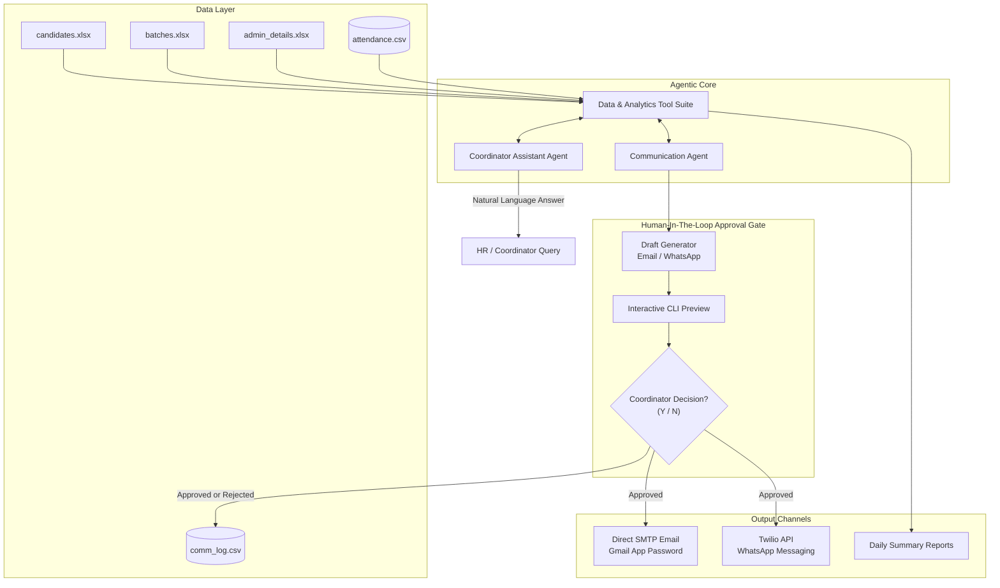

#  Admin Automation Agent

> **An agentic workflow that eliminates coordinator toil by auto-generating daily session reports, drafting targeted absentee communications, flagging schedule conflicts, and answering natural-language HR queries.**

---

[](https://www.python.org/)
[](https://ag2.ai/)
[](https://groq.com/)
[](https://www.twilio.com/)
[](LICENSE)

---

##  Problem Statement & Impact

Training program coordinators often face overwhelming administrative toil: manually cross-checking attendance, identifying absent candidates, writing individual emails/WhatsApp messages, tracking syllabus progress, and repeatedly answering HR questions regarding batch status.

Because many program coordinators are **Persons with Disabilities (PWDs)**, automating repetitive manual operations provides **direct accessibility and social impact**—saving hours of tedious workload every week and empowering coordinators to focus on high-touch candidate support.

### Key Learning & Architectural Takeaways
* **Multi-Agent Orchestration**: Autonomous LLM agent teams using the AG2 (AutoGen v0.4+) framework with tool integration.
* **Human-in-the-Loop (HITL) Design**: Safety-first workflow separating draft generation from message dispatch, requiring explicit human review.
* **Multi-Channel Integration**: Automated email delivery via direct Google SMTP and WhatsApp messaging via Twilio REST API.
* **Dynamic Data Analytics**: Automated parsing of Excel master datasets, attendance logging, syllabus progress calculation, and schedule conflict detection.

---

## System Architecture



---

##  Key Features

### 1.  Natural Language HR Query Bot
Coordinators and HR managers can ask complex questions in plain English. Powered by **AutoGen AG2** and **Groq Llama 3.3**, the agent autonomously calls analytical tools to answer questions such as:
* *"Who was absent in session 67?"*
* *"What is today's topic?"*
* *"How far are we through the teaching plan?"*
* *"Which candidates have poor attendance (< 75%)?"*

### 2.  Automated Daily Session Report Generation
Auto-calculates session metrics directly from attendance logs and batch schedules:
* Present vs. Absent counts & attendance percentages.
* Active trainer details and topic title.
* Total teaching plan progress updates.

### 3.  Absentee Outreach with Human-In-The-Loop (HITL) Guardrails
To prevent accidental or erroneous automated messaging:
* **Separation of Concerns**: The AI agent creates draft messages based on absentee records, but lacks permissions to execute message dispatches independently.
* **Interactive Approval Console**: Previews message draft, recipient email/phone, subject line, and channel in the console.
* **Coordinator Sign-Off**: Messages are dispatched **only** when the coordinator enters explicit approval (`y`). Rejections and dispatches are logged for compliance.

### 4.  Multi-Channel Communication Engine
* **Email Dispatch**: Secure direct SMTP protocol using Google App Passwords (`smtplib` + `MIMEMultipart`).
* **WhatsApp Dispatch**: Automated WhatsApp messaging via Twilio REST API integration.
* **Communication Audit Trail**: Every draft attempt, approval decision, timestamp, and API response is recorded in `comm_log.csv`.

### 5.  Syllabus Progress & Schedule Conflict Detection
* Tracks completed vs. remaining topics across all batch modules.
* Detects scheduling overlaps, missing trainer assignments, or batch timing clashes.

### 6.  Built-in Safety & Automated Evaluation Framework
* **`DRY_RUN` Mode**: Test workflows safely without sending real emails or WhatsApp messages.
* **Verification Suite**: Automated check script that validates attendance math, dataset integrity, secret isolation, and candidate ID validation.

---

##  Repository Structure

```
Admin Automation Agent/
├── Admin Automation Agent.ipynb   # Main Jupyter Notebook containing the full workflow
├── candidates.xlsx                # Master candidate roster (IDs, Names, Contacts, PWD info)
├── batches.xlsx                   # Batch schedules, module topics, trainers, dates
├── admin_details.xlsx             # Admin and coordinator metadata
├── attendance.csv                 # Runtime attendance logging database (auto-generated)
├── comm_log.csv                   # Runtime communication log & audit trail (auto-generated)
└── README.md                      # Comprehensive project documentation
```

### Data Schema Overview

| Dataset | Format | Key Fields | Description |
| :--- | :--- | :--- | :--- |
| **Candidates** | `.xlsx` | `candidate_id`, `name`, `email`, `phone`, `batch_id` | Enrolled candidates master database |
| **Batches** | `.xlsx` | `session_number`, `date`, `topic_title`, `trainer_name` | Curriculum schedule and session mapping |
| **Admins** | `.xlsx` | `admin_id`, `name`, `role`, `email`, `phone` | Staff & coordinator directory |
| **Attendance** | `.csv` | `attendance_id`, `session_number`, `candidate_id`, `status` | Daily attendance execution records |
| **Comm Log** | `.csv` | `comm_id`, `candidate_id`, `session_number`, `channel`, `status` | Audit log for all sent/rejected outreach |

---

##  Setup & Installation

### Prerequisites
* Python 3.10 or higher
* Jupyter Notebook / JupyterLab or Google Colab environment
* Groq API Key (Free tier available at [console.groq.com](https://console.groq.com))
* Gmail Account with **2-Factor Authentication** enabled & **App Password** generated (for SMTP Email)
* Twilio Account SID & Auth Token (optional, for WhatsApp dispatch)

### 1. Clone the Repository
```bash
git clone https://github.com/Rahulreddy4444/Admin_automation_agent.git
cd Admin_automation_agent
```

### 2. Install Required Dependencies
```bash
pip install pandas openpyxl autogen-agentchat twilio groq
```

---

##  Environment Variables & Configuration

Set up your API credentials in your environment or enter them securely when prompted in the notebook cells:

| Variable | Required | Description | Example |
| :--- | :---: | :--- | :--- |
| `GROQ_API_KEY` | **Yes** | Groq API Key for LLM Agent responses | `gsk_...` |
| `SMTP_EMAIL` | **Yes** (Email) | Sender Gmail address for SMTP dispatch | `coordinator@gmail.com` |
| `SMTP_APP_PASSWORD` | **Yes** (Email) | 16-character Google App Password | `abcd efgh ijkl mnop` |
| `TWILIO_ACCOUNT_SID` | Optional | Twilio Account SID for WhatsApp | `AC...` |
| `TWILIO_AUTH_TOKEN` | Optional | Twilio Auth Token for WhatsApp | `12345...` |
| `TWILIO_FROM_WHATSAPP` | Optional | Twilio Sandbox / Sender WhatsApp Number | `whatsapp:+14155238886` |
| `DRY_RUN` | **Yes** | Boolean flag (`True`/`False`) to prevent accidental sends | `True` |

>  **Gmail App Password Setup Guide**:
> 1. Enable **2-Step Verification** on your Google Account settings.
> 2. Navigate to [Google Security -> App Passwords](https://myaccount.google.com/apppasswords).
> 3. Create a new App Password for "Mail" named "Admin Automation Agent".
> 4. Use the generated 16-character password for `SMTP_APP_PASSWORD`.

---

##  Workflow & Execution Guide

Open and run `Admin Automation Agent.ipynb` sequentially. The workflow is divided into logical phases:

### Phase 1: Data Ingestion
Loads master tables from `candidates.xlsx`, `batches.xlsx`, and `admin_details.xlsx`, validating schema types and column structures.

### Phase 2: Attendance Recording
Record daily absences by candidate IDs:
```python
record_daily_absences(session_number=67, absent_candidate_ids=[1, 4])
```

### Phase 3: Analytics & Daily Report Generation
Compute attendance rates, curriculum completion, and generate daily reports:
```python
generate_daily_report(session_number=67)
```

### Phase 4: Absentee Outreach (Human-In-The-Loop)
Trigger the drafting and interactive review workflow:
```python
# Runs draft -> preview -> CLI confirmation -> dispatch flow
draft_and_approve_absentee_messages_v2(session_number=67, channel='Email')
```

**Console Output Preview:**
```text
--- EMAIL DRAFT for candidate_1 ---
Subject: Absence Notice: Session 67 - Python Fundamentals
Dear Candidate, We missed you in today's session (Session 67: Python Fundamentals)...
Approve and send? (y/n): y
 Successfully Sent!
```

### Phase 5: Multi-Agent Natural Language Querying
Ask the coordinator bot any query:
```python
answer = await ask_coordinator("Who was absent in session 67?")
print(answer)
```

### Phase 6: Automated Evaluation Suite
Run the safety and mathematical integrity verification suite:
* Verifies `present + absent == total` attendance consistency.
* Verifies `completed + remaining == total_planned` progress calculations.
* Ensures `DRY_RUN` default protection and secret isolation.

---

##  Evaluation & Validation Metrics

The project includes an built-in evaluation framework verifying critical system constraints:

| Evaluation Check | Status | Verification Detail |
| :--- | :---: | :--- |
| **Attendance Math Consistency** | `PASS` | `present + absent == total` and percentage precision |
| **Curriculum Progress Math** | `PASS` | `completed + remaining == total_planned` |
| **Human Approval Guardrail** | `PASS` | Message sending restricted strictly to explicit human sign-off |
| **DRY_RUN Safety Default** | `PASS` | System defaults to non-destructive test execution |
| **Zero Credential Hardcoding** | `PASS` | Secrets loaded dynamically via environment / secure inputs |

---

##  Contributing

Contributions are welcome! If you'd like to improve the multi-agent tools, extend messaging channel support (e.g., Slack Webhooks or Telegram), or enhance analytics:

1. Fork the Repository.
2. Create a Feature Branch (`git checkout -b feature/AmazingFeature`).
3. Commit your Changes (`git commit -m 'Add AmazingFeature'`).
4. Push to the Branch (`git push origin feature/AmazingFeature`).
5. Open a Pull Request.

---

##  License

Distributed under the MIT License. See `LICENSE` for details.

---

<p align="center">
  <i>Built with to empower PWD coordinators and streamline administrative workflows.</i>
</p>
